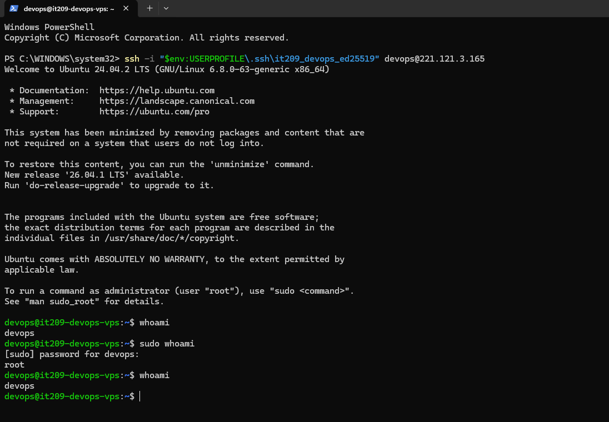
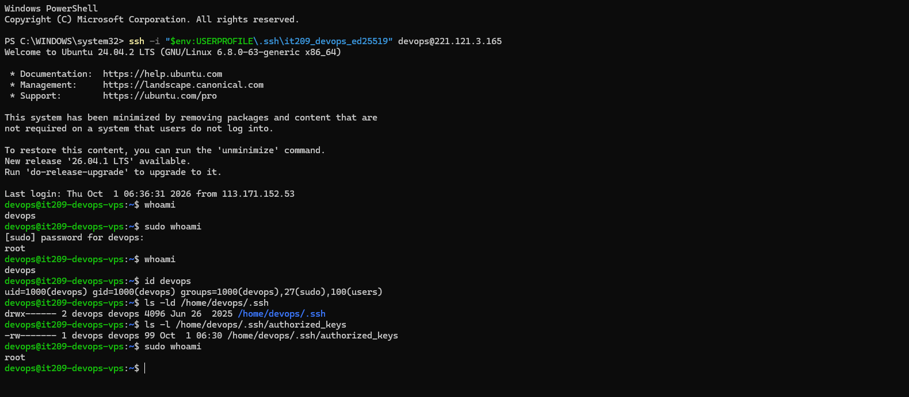
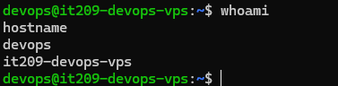

# Bài 2: Khởi tạo User thường và thiết lập đặc quyền quản trị (Sudoers Configuration)

## 1. Mục tiêu

Thực hiện cấu hình tài khoản người dùng thường trên Ubuntu Server theo nguyên tắc đặc quyền tối thiểu (Least Privilege), cụ thể:

- Tạo user `devops` thay cho việc sử dụng trực tiếp tài khoản `root`.
- Thêm user `devops` vào nhóm quản trị `sudo`.
- Cấu hình SSH Key để user `devops` có thể đăng nhập từ máy cá nhân.
- Sao chép cấu hình SSH từ tài khoản `root` sang user `devops`.
- Thiết lập đúng quyền cho thư mục `.ssh` và file `authorized_keys`.
- Kiểm tra khả năng đăng nhập SSH và thực thi lệnh quản trị bằng `sudo`.

## 2. Môi trường thực hiện

- Nền tảng VPS: WiServices Platform
- Hệ điều hành: Ubuntu 24.04.2 LTS
- Hostname: `it209-devops-vps`
- IP công khai: `221.121.3.165`
- Tài khoản ban đầu: `root`
- Tài khoản làm việc: `devops`
- Máy cá nhân: Windows
- Công cụ SSH trên Windows: OpenSSH for Windows
- Phương thức xác thực SSH: Ed25519 SSH Key

## 3. Tạo user thường `devops`

Đăng nhập VPS bằng tài khoản `root` và tạo user:

```bash
adduser devops
```

Trong quá trình thực hiện, đặt mật khẩu cho user `devops` và giữ các thông tin tùy chọn ở giá trị mặc định.

Kiểm tra user sau khi tạo:

```bash
id devops
```

Kết quả xác nhận user `devops` đã được tạo thành công.

Kiểm tra thư mục home:

```bash
ls -ld /home/devops
```

Kết quả cho thấy thư mục `/home/devops` đã được tạo và thuộc sở hữu của `devops:devops`.

## 4. Thêm user `devops` vào nhóm quản trị `sudo`

Thực hiện:

```bash
adduser devops sudo
```

Kiểm tra lại:

```bash
id devops
```

Kết quả cho thấy user `devops` thuộc nhóm:

```text
sudo
```

Nhờ đó user `devops` có thể sử dụng lệnh `sudo` để thực hiện các thao tác cần quyền quản trị.

## 5. Tạo SSH Key trên máy cá nhân

Trên Windows PowerShell, tạo một cặp khóa Ed25519:

```powershell
ssh-keygen -t ed25519 -f "$env:USERPROFILE\.ssh\it209_devops_ed25519" -C "it209-devops-vps"
```

Sau khi tạo thành công:

```text
C:\Users\dohoa\.ssh\it209_devops_ed25519
C:\Users\dohoa\.ssh\it209_devops_ed25519.pub
```

Trong đó:

- `it209_devops_ed25519`: private key, được giữ bí mật trên máy cá nhân.
- `it209_devops_ed25519.pub`: public key, dùng để cấu hình xác thực trên VPS.

Private key không được đưa lên GitHub.

## 6. Cấu hình public key cho tài khoản root

Kiểm tra cấu hình SSH ban đầu của root:

```bash
ls -la /root/.ssh
```

Tại thời điểm cấu hình ban đầu, file:

```text
/root/.ssh/authorized_keys
```

đang tồn tại nhưng có kích thước `0` byte.

Public key được tạo trên máy cá nhân được bổ sung vào `authorized_keys` của root bằng lệnh:

```powershell
Get-Content "$env:USERPROFILE\.ssh\it209_devops_ed25519.pub" | ssh root@221.121.3.165 "cat >> /root/.ssh/authorized_keys"
```

Sau đó kiểm tra khả năng đăng nhập root bằng SSH Key:

```powershell
ssh -i "$env:USERPROFILE\.ssh\it209_devops_ed25519" root@221.121.3.165
```

Kết quả đăng nhập thành công và:

```bash
whoami
```

trả về:

```text
root
```

## 7. Cài đặt và sử dụng `rsync`

VPS Ubuntu được cài đặt ở chế độ tối giản nên `rsync` chưa có sẵn. Cài đặt bằng:

```bash
apt update
apt install -y rsync
```

Kiểm tra phiên bản:

```bash
rsync --version
```

Kết quả cho thấy `rsync` đã được cài đặt thành công.

## 8. Sao chép cấu hình SSH sang user `devops`

Sử dụng đúng lệnh theo yêu cầu bài tập:

```bash
sudo rsync --archive --chown=devops:devops /root/.ssh /home/devops/
```

Lệnh trên sao chép thư mục SSH của root sang:

```text
/home/devops/.ssh
```

đồng thời đặt owner thành:

```text
devops:devops
```

Kiểm tra:

```bash
ls -la /home/devops/.ssh
```

Kết quả cho thấy file:

```text
authorized_keys
```

đã được sao chép sang thư mục của `devops`.

### Minh chứng



## 9. Thiết lập quyền cho `.ssh` và `authorized_keys`

Kiểm tra quyền sau khi sao chép:

```bash
ls -ld /home/devops/.ssh
ls -l /home/devops/.ssh/authorized_keys
```

Kết quả thực tế:

```text
/home/devops/.ssh
→ owner: devops:devops
→ permission: 700

/home/devops/.ssh/authorized_keys
→ owner: devops:devops
→ permission: 600
```

Các quyền được thiết lập theo cấu hình bảo mật SSH:

```bash
sudo chmod 700 /home/devops/.ssh
sudo chmod 600 /home/devops/.ssh/authorized_keys
```

Owner được bảo đảm bằng:

```bash
sudo chown -R devops:devops /home/devops/.ssh
```

### Minh chứng



## 10. Kiểm tra đăng nhập SSH bằng user `devops`

Từ máy cá nhân Windows, sử dụng private key để đăng nhập:

```powershell
ssh -i "$env:USERPROFILE\.ssh\it209_devops_ed25519" devops@221.121.3.165
```

Đăng nhập thành công với prompt:

```text
devops@it209-devops-vps:~$
```

Kiểm tra tài khoản hiện tại:

```bash
whoami
```

Kết quả:

```text
devops
```

Kiểm tra hostname:

```bash
hostname
```

Kết quả:

```text
it209-devops-vps
```

### Minh chứng



## 11. Kiểm tra quyền quản trị bằng sudo

Sau khi đăng nhập bằng user `devops`, thực hiện:

```bash
sudo whoami
```

Hệ thống yêu cầu nhập mật khẩu của `devops`.

Kết quả:

```text
root
```

Sau đó kiểm tra lại tài khoản đăng nhập:

```bash
whoami
```

Kết quả:

```text
devops
```

Điều này chứng minh:

- Phiên đăng nhập SSH đang sử dụng user thường `devops`.
- User `devops` được cấp quyền quản trị thông qua nhóm `sudo`.
- Lệnh `sudo` có thể thực thi thành công với quyền `root`.

### Minh chứng

Kết quả `sudo whoami` được thể hiện trong ảnh:


## 12. Kết quả

Bài tập đã hoàn thành các yêu cầu:

- [x] Tạo tài khoản người dùng thường `devops`.
- [x] Thêm `devops` vào nhóm quản trị `sudo`.
- [x] Tạo và cấu hình SSH Key Ed25519.
- [x] Sao chép cấu hình SSH từ `/root/.ssh` sang `/home/devops/.ssh`.
- [x] Thiết lập owner `devops:devops`.
- [x] Thiết lập quyền `700` cho thư mục `.ssh`.
- [x] Thiết lập quyền `600` cho file `authorized_keys`.
- [x] Đăng nhập SSH thành công bằng user `devops`.
- [x] Kiểm tra `sudo whoami` trả về `root`.

## 13. Lưu ý bảo mật

Private SSH key:

```text
C:\Users\dohoa\.ssh\it209_devops_ed25519
```

được lưu trên máy cá nhân và không được đưa vào repository GitHub.

Không đưa mật khẩu VPS hoặc thông tin xác thực vào README hoặc GitHub.
